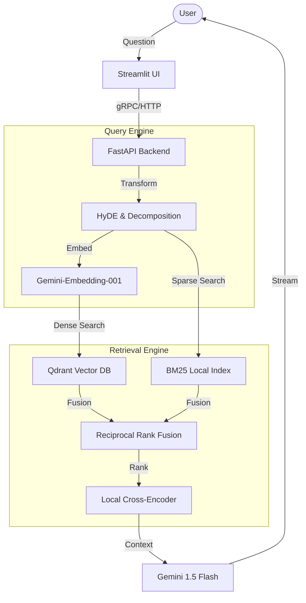

# 🛡️ Advanced RAG: Production-Grade AI Assistant

An industry-standard Retrieval-Augmented Generation (RAG) pipeline featuring **Hybrid Search**, **Cross-Encoder Reranking**, and **Real-time Streaming**. Built for performance, observability, and accuracy.

---

## 🚀 Features

- **Hybrid Retrieval**: Combines Semantic (Dense) search with Keyword (BM25) search for maximum recall.
- **Cross-Encoder Reranking**: Utilizes `ms-marco-MiniLM-L-6-v2` to refine search results locally.
- **Advanced Query Transformation**: Supports **HyDE** (Hypothetical Document Embeddings) and **Query Decomposition**.
- **Industry Tracking**: Integrated with **LangSmith** for full-chain observability and tracing.
- **Production API**: Async FastAPI backend with streaming word-by-word responses.
- **Interactive UI**: Streamlit dashboard with live chat, source citations, and evaluation metrics.
- **Containerized**: Fully Dockerized for seamless deployment to any cloud provider.

---

## 🏗️ Architecture



---

## 🛠️ Tech Stack

- **LLM**: Google Gemini 1.5 Flash / 1.5 Pro
- **Vector DB**: Qdrant (Support for Local & Cloud)
- **Frameworks**: LangChain, FastAPI, Streamlit
- **Reranker**: Sentence-Transformers (MiniLM)
- **Observability**: LangSmith
- **Infrastructure**: Docker, Render.com

---

## ⚡ Quick Start

### 1. Environment Setup
Create a `.env` file in the root directory:
```env
GOOGLE_API_KEY=your_key_here
QDRANT_URL=http://localhost:6333
LANGCHAIN_TRACING_V2=true
LANGCHAIN_API_KEY=your_langsmith_key
```

### 2. Run with Docker
```bash
docker build -t rag-app .
docker run -p 8000:8000 -p 8501:8501 --env-file .env rag-app
```

### 3. Manual Installation
```bash
pip install -r requirements.txt
python api.py & streamlit run app.py
```

---

## 🧪 Evaluation & Quality
The system includes a custom **DeepEval** framework to measure performance across:
- **Faithfulness**: Ensure no outside knowledge is used.
- **Answer Relevancy**: Guarantee user questions are directly addressed.
- **Context Recall**: Verify the retriever is finding the correct documents.

---

## ☁️ Deployment (Render.com)

1. **GitHub**: Push your code to a GitHub repository.
2. **New Web Service**: Connect your repo to Render.
3. **Runtime**: Select `Docker`.
4. **Env Vars**: Add your `GOOGLE_API_KEY`.
5. **Success**: Render will build the Dockerfile and deploy your RAG app to a live URL!
